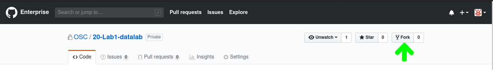
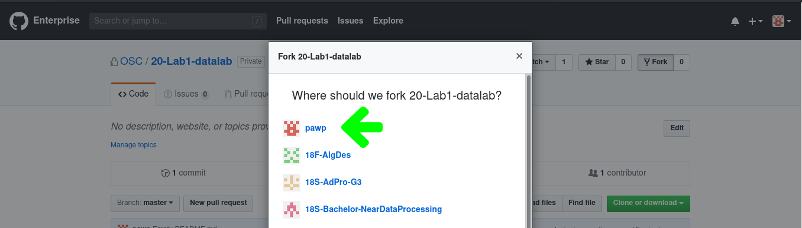
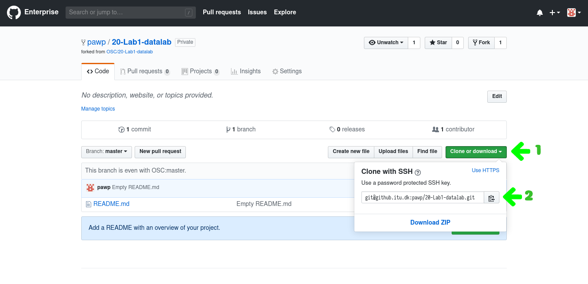
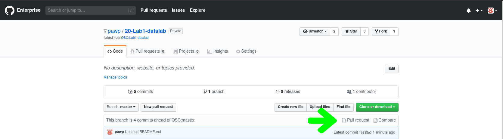
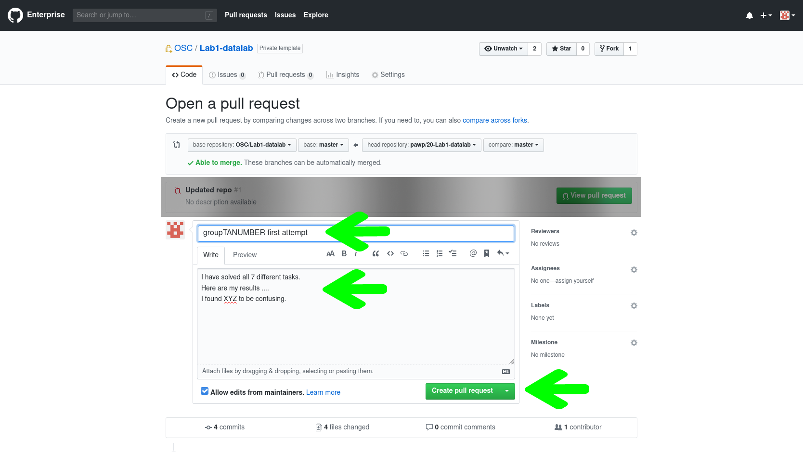

# Malloclab

In this assignment you will have to edit a file, `mm.c`, written in the C
programming language to write as optimal a heap allocator as possible.

Please note that the images are reused from datalab, so you should adjust
information, such as URLs, from them accordingly.

This README details how you should handle this assignment:

1. [Setting up malloclab](#setting-up-malloclab)
2. [Doing the assignment](#doing-the-assignment)
3. [Submitting your work](#submitting-your-work)


## Setting up malloclab
You must fork this repository to your own user account and work on the
assignment from that fork. When you are done, you should create a pull request
against the original repository.


### Fork repository
The following images illustrate how to fork the course repository.

First press the Fork-button on the lab repository:



You may have to select the organisation or owner of the fork.<br>
Select your ITU username:



When forked, we need to get the repository’s URL to clone from.<br>


If you use the default URL from the popup resulting from step 1 in the image
above, you will clone using the SSH-protocol, which requires that you have
uploaded a public key to GitHub beforehand (see
[this link](https://devconnected.com/how-to-setup-ssh-keys-on-github/)
for information on how to use SSH keys to interact with GitHub). If you prefer
to authenticate with your ITU username and password, you should press
`Use HTTPS` at the top of the popup and use that URL instead.

### Setup your working copy of the repo
Switch to a terminal (logged in to the course server, for instance) and do the
following:
```
# Download git repository:
# (replace pawp with your own user name and the URL as described above)
git clone git@github.itu.dk:pawp/20-Lab3-malloclab.git Lab3-malloclab

# Change into cloned directory
cd Lab3-malloclab

# Checkout your group’s branch (replace XX with your group number)
git checkout -b groupXX

# Make initial push to remote to set upstream clone URL (replace XX again)
git push -u origin groupXX
```


## Doing the assignment
You should now have access to the course files on your user account and have set
up a tracking branch corresponding to your username on your own fork of the
repository.<br>
You are now ready to edit `mm.c` according to the instructions in the
assignment [pdf file](./malloclab.pdf) and the handout’s original
[README](./README).

Example workflow:
```
# Open and edit the assignment file in vim
# (remeber to read what's already there and filling in your team struct)
vim mm.c

# Create the driver for running and testing your solution
make

# Quick test run
./mdriver -V -f short1-bal.rep

# Test with full test suite
./mdriver -V

# Assuming that the above instructions do not result in errors, commit them.
git add mm.c
git commit -m “Filled in my team struct.”
```    

It is good practice to do the last step regularly.<br>
Try making a habit out of committing each new thing that you try out -preferably
when it works- to more effectively use your revision history.


## Submitting your work
When you are ready to submit the assignment, you should commit any outstanding
changes to `mm.c` and push them to your fork. Then, create a pull request to
the “forked-from” repository, as illustrated below.


### Push changes to your branch
Add changed `mm.c`-file to staging area, then commit staged file:
```
git add mm.c
git commit -m “Hand-in from groupXX (pawp). Final version.”:
```

Push changes to your fork:
```
git push
```
   
### Create a pull request
On ITU’s github, on your fork’s repository frontpage
(`https://github.itu.dk/<YOUR_ITU_USERNAME>/20-Lab3-malloclab`) you can see how
many commits you have made since forking and there is a little button in the
same line that allows you to make pull requests against the repository and
branch that was forked from:




This will take you to the following page, where you should:

1. Enter your full group name (`groupXX`, where `XX` is your group number) in the title.
2. Type in comments to your handins (sorta like assignment comments on LearnIT)
3. Press the green `Create pull request`-button<br>
   (alternatively, you can press the downward arrow right next to it and only
   open the PR in `DRAFT` mode indicating that it is not yet ready for TA
   review).



